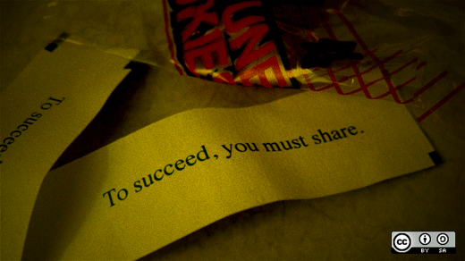
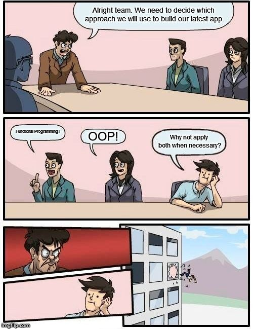
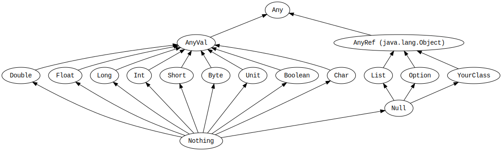
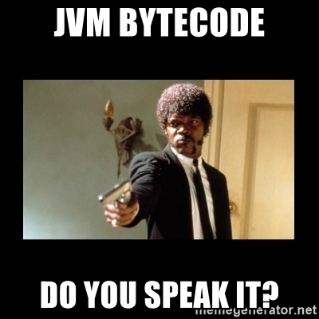

<!-- data-background-color="#002b36" .slide: data-background="img/lausanne.jpg" data-background-size="fit" data-background-opacity="0.7" -->

### Scala in 60 minutes

----

## Welcome! 🙋‍♂️

<iframe data-src="https://wall.sli.do/event/dXqAHbwyVLvpenGS27Su8R?section=052d8cc8-d57a-41ae-a63e-458cc3afa573" height="100%" width="100%" style="min-height: 640px;" ></iframe>

----


## Index


- 👴 History
- 🏞️ Ecosystem & ideology
- 💬 Language features
- 🍴 Bytecode
- 🦹 Advanced features
- 👠 Multi-platform

<!-- .element class="no-list" -->

---

# History

----

<!-- .slide: data-background="img/scala-stairs.jpg" data-background-size="contain" data-background-opacity="0.6" -->

## Quick facts

- 🐣 January 2004
- 👨‍🏫 Designed by Martin Odersky @ EPFL
- 🍕 Pizza
- 🪜 Scalable Language & Stairs
- 3️⃣ Scala 3

<!-- .element class="no-list" -->

----

## A modern language

- Type-safe & statically typed
- Type inference
- Concise, but expressive
- Java interop
- Higher-order functions
- 'Sealed' classes
- Strong std lib
- Intersection & union types
- Performant

---

# Ecosystem & ideology

----

<!-- .slide: data-background="img/cathedral-bazaar.jpg" data-background-size="fit" data-background-opacity="0.4" -->

## Cathedral and the Bazaar

- Both can be open-source
- <!-- .element class="fragment" data-fragment-index="1" --> Release schedules
- <!-- .element class="fragment" data-fragment-index="2" --> Public vs "private"
- <!-- .element class="fragment" data-fragment-index="3" --> Rewrite vs reuse

> With enough eyeballs all bugs are shallow
<!-- .element class="fragment" data-fragment-index="4" -->
----

## Open-source ecosystem



<iframe height="600" style="width: 100%;" scrolling="no" data-src="charts.html" frameborder="no" loading="lazy">
</iframe>
 <!-- .element class="fragment" data-fragment-index="1" -->

----
# FP & OOP



----

## Classes, traits

```scala
trait Animal {
  def speak(): Unit
}
trait HasTail {
  def wagTail(): Unit
}

class Dog extends Animal, HasTail {
  def speak() = println("Woof")
  def wagTail() = println("🐕")
}
```
----

## Methods & mutability

```scala
trait Pet

class Cat(name: String) extends Pet {
  def call(): String = s"Meow, I am ${name}!"

  private var plantsEaten = 0
  private def sneak(): Unit = plantsEaten += 1
}

cat.call() // Meow, I am Minoes!
```

----

## Everything is an object



----

<!-- .slide: data-auto-animate -->

## Every "operator" is a method

```scala
4 + 2

// 'Ctrl-click'
def +(x: Int): Int
```

<!-- .element data-id="code-animation" -->

----

<!-- .slide: data-auto-animate -->

## Every "operator" is a method

```scala
4 + 2

// 'Ctrl-click'
def +(x: Int): Int

4.+(2)
```

<!-- .element data-id="code-animation" -->

----


## FP


----
<!-- .slide: data-auto-animate -->

## Every function is a value

```scala
// Similar to (x: Int, y: Int)
val add = (x: Int) => (y: Int) => x + x
add(1)(2) // 3
```
<!-- .element data-id="code-animation" -->

----
<!-- .slide: data-auto-animate -->

## Every function is a value

```scala
// Similar to (x: Int, y: Int)
val add: Int => Int => Int = (x) => (y) => x + y

val addOne: Int => Int = (x) => add(x, 1)
// Or
val addOne: Int => Int = add(_, 1)

addOne(2) // 3
```
<!-- .element data-id="code-animation" -->

----

## Immutability

> To change your age in FP, you must first copy the universe

----

## Nested functions

```scala
def factorial(x: Int): Int = {
  @tailrec
  def fact(x: Int, accumulator: Int): Int = {
    if (x <= 1) accumulator
    else fact(x - 1, x * accumulator)
  }  
  fact(x, 1)
}
```

----

## Referential transparency

- No side effects
- Replace by its result without changing behaviour

<iframe data-src="https://wall.sli.do/event/dXqAHbwyVLvpenGS27Su8R?section=052d8cc8-d57a-41ae-a63e-458cc3afa573" height="100%" width="100%" style="min-height: 640px;" ></iframe>

---

# Language features

----

## No-nonsense nullishness

```scala
// New, not used as much
val hello: String               = "Hello"
val stringOrNull: String | Null = null

if (stringOrNull != null) {
  println(stringOrNull.toUpperCase())
}

// More 'idiomatic Scala':
// One of many data structures in the stdlib
val maybeHello: Option[String] = None
val alsoMaybeHello: Option[String] = Some("Hello")

maybeHello.map(_.toUpperCase).foreach(println)
```

----
## Case classes

  
```scala
case class Cat(name: String)

val cat = Cat("Smokey")
val cat2 = Cat("Smokey")

cat == cat2 // true

val cat3 = cat.copy(name = "Ori") // Cat("Ori")
```
----

## Pattern matching

>> Demo

----

## Extension methods

>> Demo

----

## Enums

>> Demo

----

## For-comprehensions & data structures

>> Demo

---
## That's nice, but I like staring at bytecode



---

# Advanced stuff

----

## Given, using

>> Demo

----

## Opaque types

>> Demo

----

## Match types

>> Demo

----

## Type lambdas

>> Demo

----

## Inline

>> Demo

----

## Other platforms

>> Demo

---

<iframe src="https://giphy.com/embed/xUPOqo6E1XvWXwlCyQ" width="480" height="270" frameBorder="0" class="giphy-embed" allowFullScreen></iframe>

<iframe data-src="https://wall.sli.do/event/dXqAHbwyVLvpenGS27Su8R?section=052d8cc8-d57a-41ae-a63e-458cc3afa573" height="100%" width="100%" style="min-height: 400px;" ></iframe>
